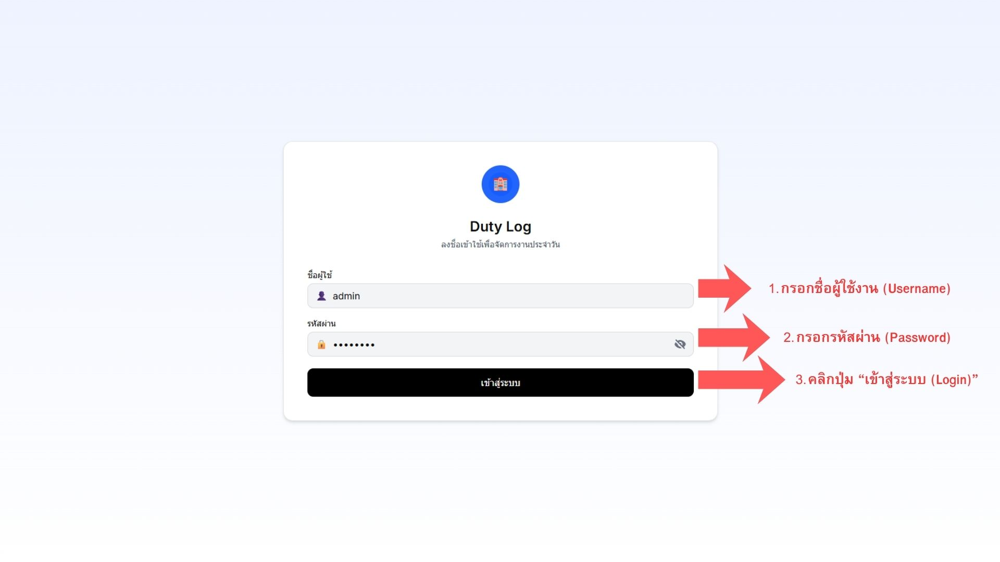

# Duty Log — Hotel Daily Log Template

A clean, modern frontend template for hotel duty log / daily report systems. Built with React, TypeScript, and Tailwind CSS — ready for developers to connect to their own backend and customize.

> ⚠️ **Important:** This is a **frontend UI template** using mock data (`lib/mockData.ts`). It is **not** connected to a real database or backend. It's designed for developers who want a polished starting point and will implement their own API/database integration.

---

## 🖼️ Screenshots

Add screenshots here before publishing



---

## ✨ Features

- 📋 Duty log entry form for daily hotel records
- 📑 List/table view with filtering
- 👤 User management UI
- 📊 Export to Excel (via `xlsx` / `exceljs`)
- 🎨 Modern UI built with shadcn/ui components + Tailwind CSS
- 🔐 Login page UI (auth logic to be connected to your backend)

## 🛠️ Tech Stack

- React 18.3 + TypeScript
- Vite 7
- Tailwind CSS 4
- shadcn/ui + Radix UI primitives
- React Hook Form
- Recharts (for any reporting/charts)

## 📦 What's Included

- Full source code (components, types, styles)
- Mock data for demo/development purposes
- Setup guide (see `SETUP_GUIDE.md`)

## ❗ What's NOT Included

- Backend / API server
- Database integration
- Real authentication (current login is UI-only, not secure — must be replaced before production use)

This template is best suited for developers comfortable connecting a frontend to their own backend (Node.js, Supabase, Firebase, etc.).

## 🚀 Getting Started

```bash
npm install
npm run dev
```

App runs at `http://localhost:5173`

See `SETUP_GUIDE.md` for detailed setup instructions and troubleshooting.

## 📁 Project Structure

```
duty-log-code/
├── App.tsx
├── components/        # React components (form, list, login, navbar, user management)
├── lib/                # Utilities, mock data, export logic
├── styles/             # Global CSS
├── types/              # TypeScript types
└── ui/                 # shadcn/ui components
```

## 📄 License

This template is sold under a **Single-Use Commercial License**. See `LICENSE.md` for full terms. In short:

- ✅ Use in one (1) end product / project per license purchased
- ✅ Modify and customize freely for your project
- ❌ Do not resell, redistribute, or re-publish the source code itself
- ❌ Do not use across multiple unrelated projects without an additional license

## 💬 Support

Questions about setup or customization? [Add your contact/support info here]
